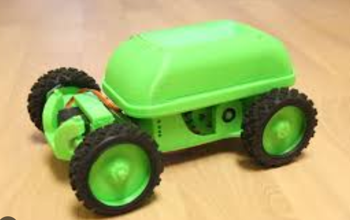
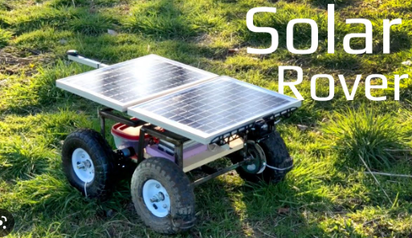

# dit is het main idee

## RC auto met raspberry pi

Wat ik dacht dat vet was is een afstands bestuurbare auto met hele lange range. 3-5 km het liefst.
Met een video uitput  
vanuit een raspberry pi, je hebt een programma op je pc of master pi waaruit je met toetsebord de auto kan besturen.  
Op dit programma heb je een live video feed en audio feed.  
 
Ik heb al een odroid wat ongeveer hetzelfde is als een normale raspberri pi 4. En een oudere respberry pi 2.
 
de oudere raspberry pi kan dan worden gebruikt voor op de auto zelf(de slave) en dan de odroid als master.

  
de main body bestaat uit 3d geprint matriaal, de wielen zijn ook geprint en het is gemaakt om op sloome snelheid te werken.

### inspiratie:

